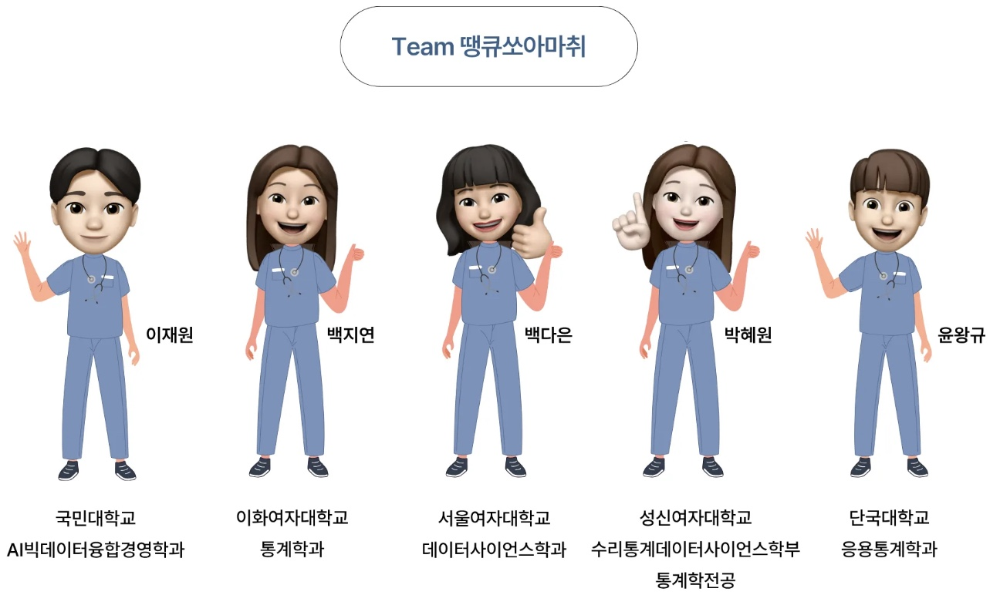
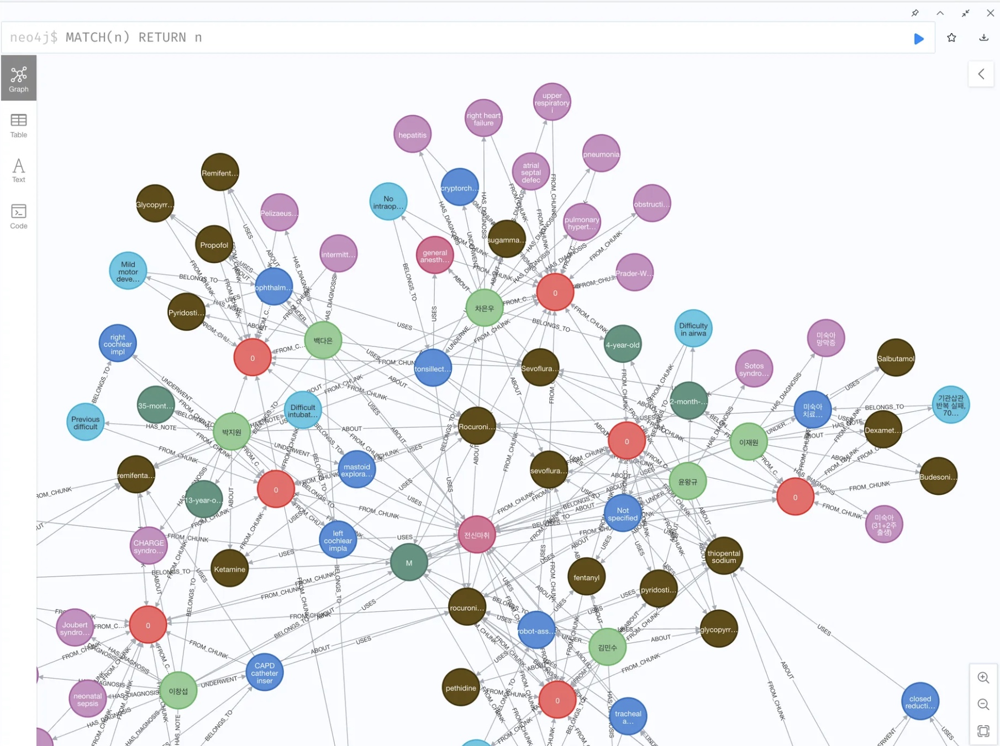
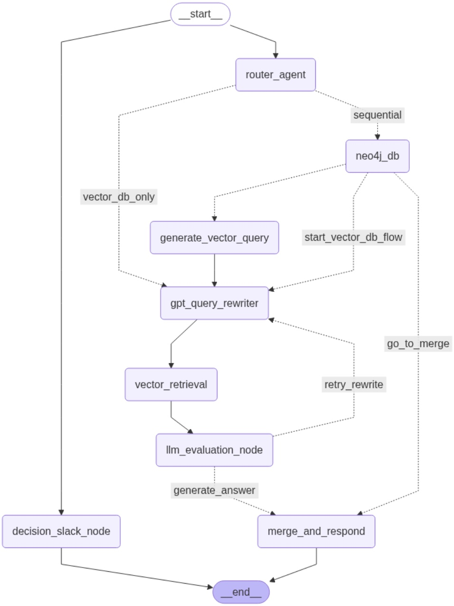
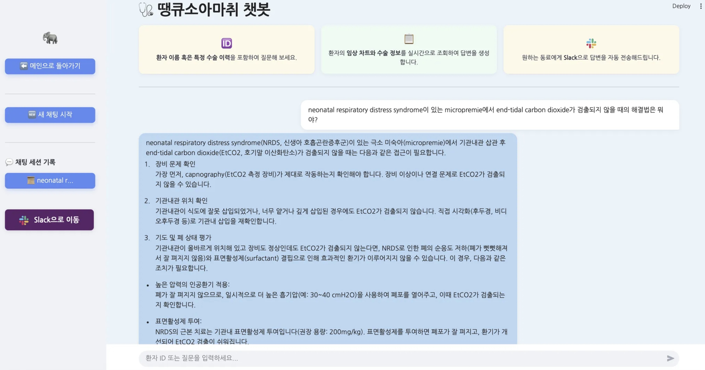
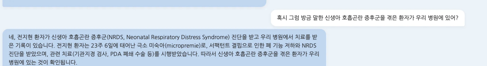
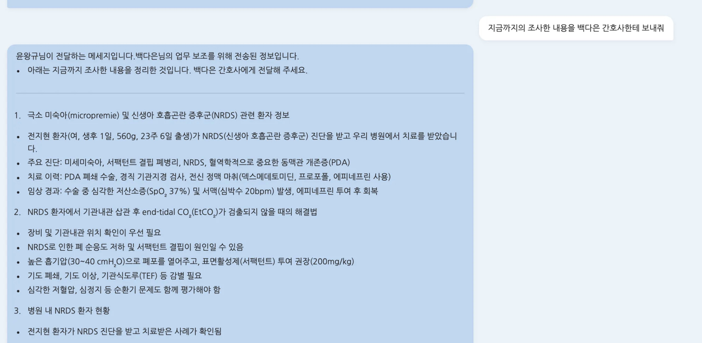
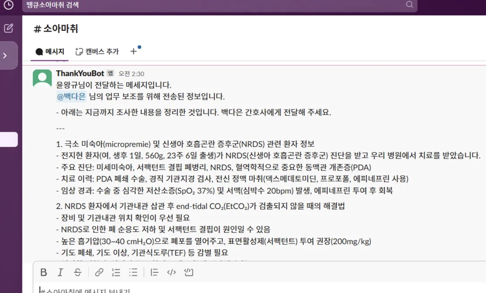

<div align=center>
  
**소마챗**은 소아 마취 전문 의료진의 진료 흐름에 자연스럽게 녹아들어,<br>
**정확성과 신뢰성**을 바탕으로 즉각적인 처치 판단을 지원하는 AI 어시스턴트입니다.

1️⃣ **다양한 임상 상황에서의 질문**을 이해하고,  
2️⃣ 환자 정보부터 처치 지침, 관련 의학 지식까지 **포괄적인 검색과 분석**을 수행하며,  
3️⃣ 검색 결과를 요약하여 **Slack을 통해 지정 담당자에게 자동 전달**합니다.
</div>

## 🏥 Clinical Collaboration

본 프로젝트는 **서울대학교병원 의생명정보학 연구실(BMI Lab)** 과의 공동 연구 및 협력을 바탕으로 개발되었습니다.
> Special thanks to the lab members for providing sample datasets and continuous feedback throughout development.

## 🗓️ Timeline
2025.02 ~ 2025.08

## 👪 Team
<p align="center">
  
</p>

**이재원** ([Jaewon1634](https://github.com/Jaewon1634)) · **백지연** ([wlsisl](https://github.com/wlsisl)) · **백다은** ([nuebaek](https://github.com/nuebaek)) · **박혜원** ([nowhye](https://github.com/nowhye)) · **윤왕규** ([yoonwanggyu](https://github.com/yoonwanggyu)) 
> 📝 This project was carried out by the 23rd cohort of the **BOAZ**.

## 📚 Project Structure

```plaintext
📂 (작업 중인 폴더)            # ◀︎ Git 레포 루트 디렉토리
├── main.py                  # LangGraph 실행 진입점 (백엔드 플로우 테스트용)
├── app.py                   # Streamlit 기반 챗봇 UI 실행 파일
├── .env                     # 비밀 키, API 토큰 등 환경 설정 (gitignore에 포함)
├── requirements.txt         # 프로젝트 실행에 필요한 패키지 목록
├── README.md                # 프로젝트 소개 문서
│
├── pictures/                # 프로젝트 설명용 이미지
│   ├── 0008D232-...jpeg
│   └── 9FCCE7B8-...jpeg
│
├── src/                     # 주요 파이썬 소스 코드 디렉토리 (패키지화 가능)
│   │
│   ├── agent.py             # LangGraph에서 사용할 LLM Agent 정의
│   ├── mcp_client.py        # MCP(Multi-Component Protocol) 클라이언트 정의
│   ├── prompt.py            # 프롬프트 템플릿 및 역할별 시스템 메시지 정의
│   │
│   ├── else/                # 기타 자원 및 파일 보관 디렉토리
│   │   ├── Pediatric_Terminology.xls  # 소아 마취 용어 및 분류 파일
│   │   └── image.png                  # Streamlit용 이미지
│   │
│   ├── evaluator/          # 평가 노드 로직 (LLM-as-a-Judge)
│   │   └── query_rewrite_llm_evaluator.py   # 쿼리 재작성 평가를 위한 LLM 평가자
│   │
│   ├── langgraph/          # LangGraph 파이프라인 구성 모듈
│   │   ├── edge.py         # 노드 간 흐름 제어 (조건 분기 등)
│   │   ├── nodes.py        # LangGraph에서 실행되는 주요 기능 노드들
│   │   └── state.py        # 그래프 전반에서 공유되는 상태(State) 정의
│   │
│   └── server/             # MCP 서버 모듈
│       ├── embedder.py         # 벡터 검색용 텍스트 임베딩 생성기
│       ├── neo4j_server.py     # 환자 그래프 데이터 검색기 (Neo4j)
│       └── pinecone_server.py  # 지식 기반 문서 검색기 (Pinecone)
```

## ⚙️ Tech Stack Overview
- 🧩 **LangGraph**  
  상태 기반 LLM 프레임워크로, 복잡한 에이전트 워크플로우를 유연하게 설계할 수 있습니다.  
  → 본 프로젝트에서는 Agentic RAG 흐름(의도 분기 → 검색 → 평가 → 응답 → 전송)을 LangGraph로 구현했습니다.

- 🔗 **MCP (Model Context Protocol)**  
  AI 모델과 외부 시스템 간 양방향 통신을 지원하는 오픈 프로토콜입니다.  
  → 챗봇 응답을 분석해 Slack 채널로 자동 전송하는 기능을 구현했습니다.

- 🧬 **Neo4j (GraphDB)**  
  환자 상태, 처치, 약물 정보를 그래프 구조로 저장·분석하는 데이터베이스입니다.  
  → 복잡한 환자 관계를 시각적으로 모델링하고 의학 지식과 연결합니다.

- 📚 **Pinecone (VectorDB)**  
  의미 기반 유사도 검색이 가능한 벡터 데이터베이스입니다.  
  → 의료 지식 문서를 임베딩하여 정확하고 의미 있는 검색 결과를 제공합니다.

- 💬 **Streamlit**  
  의료진이 직관적으로 질문하고 응답을 받을 수 있는 웹 UI를 제공합니다.  
  → 대화형 인터페이스를 통해 실시간 응답 흐름을 시각적으로 확인할 수 있습니다.

## 🗂️ Database
의료 데이터의 성격과 활용 목적에 최적화된 이중 데이터베이스 구조를 설계하였습니다.

1️⃣ **Graph Database (Neo4j)**  
   : 대한소아마취학회 APM 학회지의 Pediatric Anesthesia 증례 보고서 33건을 기반으로 구축

   <p align="center">
     
   </p>

   <details>
   <summary> 🔍 데이터 구성 및 처리 과정 (펼쳐보기) </summary>

   • PDF → JSON 변환 후 환자 중심 정보 추출 및 정제  
   • 도메인 스키마 엔티티: Person, UserSeg, Diagnosis, Surgery, AnesthesiaType, AnesthesiaAgents, Notes  
   • 관계(Relations): BELONGS_TO, HAS_DIAGNOSIS, UNDERWENT, USES, ABOUT, HAS_NOTE  
   • 모든 노드는 text-embedding-3-large 모델로 256차원 벡터 임베딩  
   • 유사 노드 + 1-hop 이웃 노드 검색으로 풍부한 컨텍스트 확보  
   • 검색 결과는 GPT-4 기반 응답 생성 시 핵심 정보로 활용  

   </details>

2️⃣ **Vector Database (Pinecone)**  
   : Pediatric Anesthesia 논문 95건 (APM 학회지), PubMed Abstract 약 26,000건 기반 구축

   <details>
   <summary> 🔍 데이터 구성 및 처리 과정 (펼쳐보기) </summary>

   • PDF 문서는 Upstage Document Parser API를 사용해 구조적 JSON으로 변환  
   • 의미 단위 중심 시퀀스 재구성 + 수작업 클린업  
   • RecursiveCharacterTextSplitter 적용 (chunk size: 1000, overlap: 50)  
   • 문서 메타데이터 구성: title, content, year → LangChain Document 객체화  
   • text-embedding-ada-002 모델로 임베딩 후 Pinecone DB에 저장  
   • 이후 LLM 검색 시 벡터 유사도 기반 근거 문서로 사용됨  

   </details>

## 🗺️ LangGraph Execution Flow
<p align="center">
  
</p>

<details>
<summary> 🔍 LangGraph 노드별 처리 흐름(펼쳐보기) </summary>

#### 1. 🧭 router_agent – 질문 분석 및 라우팅  
• 사용자의 자연어 질문을 분석하여 GPT-4 기반 Router Agent가 `flow_type`을 분류합니다.  
• 다음 중 하나의 흐름으로 분기됩니다:  
  - `neo4j_only`: 특정 환자 정보만 필요  
  - `vector_db_only`: 일반 의학 지식만 필요  
  - `parallel`: 두 DB 모두 필요  
  - `sequential`: Neo4j 기반 후속 VectorDB 검색  
• 판단 결과는 LangGraph의 상태(State)로 전달되어 최적 경로가 구성됩니다.  

#### 2. 🧬 neo4j_db – 환자 그래프 DB 검색  
• 환자의 상태, 처치 이력, 약물 정보 등을 Neo4j에서 조회합니다.  
• 결과는 후속 노드에서 통합 응답에 활용됩니다.  

#### 3. 🧠 generate_vector_query – 벡터 질의 생성  
• 사용자의 질문 또는 Neo4j 응답을 바탕으로 VectorDB 검색용 초기 질의를 생성합니다.  

#### 4. ✏️ gpt_query_rewriter – 질의 최적화 루프  
• 쿼리를 최대 3회까지 재작성하며 검색 성능을 향상시킵니다:  
  1. 영문화  
  2. 용어 정규화 및 동의어 추가  
  3. 구조 변경  

#### 5. 🔍 vector_retrieval – 유사도 기반 문서 검색  
• 각 쿼리 후보를 Pinecone DB에 질의하여 의료 지식 문서를 검색합니다.  

#### 6. 📊 llm_evaluation_node – 검색 결과 평가  
• LLM이 검색 결과를 다음 기준에 따라 평가합니다:  
  - 관련성 (Relevance)  
  - 사실 일치도 (Faithfulness)  
  - 완전성 (Completeness)  
  - 점수 평균이 0.7 미만이면 쿼리를 재작성하고 검색–평가 루프를 최대 3회 반복합니다.  

#### 7. 🧩 merge_and_respond – 응답 통합 및 생성  
• Neo4j + VectorDB 결과를 통합하여 GPT-4가 최종 자연어 응답을 생성합니다.  

#### 8. 📤 decision_slack_node – Slack 전송 판단 및 실행  
• 질문에 “보내줘”, “전송해줘” 등 키워드가 포함되면 실행됩니다.  
• 흐름:  
  1. 수신자 이름 파악  
  2. Slack 사용자 ID 조회  
  3. 멘션 메시지 생성 및 자동 전송  

#### 9. ✅ end – 최종 응답 반환  
• 생성된 응답을 사용자에게 반환하며 플로우를 종료합니다.
</details>

## 🧪 Chatbot Evaluation Scenarios
1️⃣ 챗봇이 **내부 데이터베이스에 정확히 접근하여 답변을 생성하는지** 확인합니다.<br>
2️⃣ 사용자와의 멀티턴 대화가 원활하게 이루어지는지**를 검증합니다.<br>
3️⃣ 사용자가 **Slack 전송을 요청했을 때 해당 내용이 자동으로 Slack에 전송되는지** 여부를 확인합니다.<br>
<p align="center">
  
  
  
  
</p>

## 🚀 Getting Started
1️⃣ 레포지토리 클론
```bash
git clone 
cd your-repo-name
```
2️⃣ 필수 라이브러리 설치
```bash
pip install -r requirements.txt
```

3️⃣ 환경 변수 설정 (.env 파일 생성)<br>
📌 Neo4j 그래프 DB나 Pinecone 벡터 DB에 연결된 실제 환경이 필요하다면, 프로젝트 팀원에게 별도로 문의해주세요.
```bash
# GPT API 설정
OPENAI_API_KEY=''

# Neo4J 설정
NEO4J_URI=''
DATABASE=''
AUTH_LINK=''

# Pinecone 설정
PINECONE_API_KEY=''

# Slack MCP 설정
SLACK_BOT_TOKEN=''
SLACK_TEAM_ID=''
```

4️⃣ mcp_client.py 실행을 위한 파이썬 경로 설정
```bash
"command": "본인 로컬 PYTHON 경로"
```

5️⃣ LangGraph 기반 챗봇 로직 실행
```bash
python main.py
```

6️⃣ 의료진용 Streamlit UI 실행
```bash
streamlit run medical_chat_bot.py
```

## 🙌 Contributing
🎉 이 프로젝트는 오픈소스 커뮤니티의 기여를 적극 환영합니다!
기여를 원하신다면 아래 단계를 따라주세요:

1️⃣ 레포지토리 포크<br>
2️⃣ 새로운 브랜치 생성
```bash
git checkout -b feature/기능명
```
3️⃣ 변경 사항 커밋
```bash
git commit -m "기능 설명"
```
4️⃣ 브랜치 푸시
```bash
git push origin feature/기능명
```
5️⃣ Pull Request 생성
```bash
GitHub에서 PR을 생성하고, 변경 내용을 설명해 주세요.
```

💡 버그 제보나 기능 제안은 언제든지 이슈 등록을 환영합니다!

## 📜 License

이 프로젝트는 MIT 라이선스 하에 배포됩니다.자세한 내용은 LICENSE 파일을 참고해 주세요.
